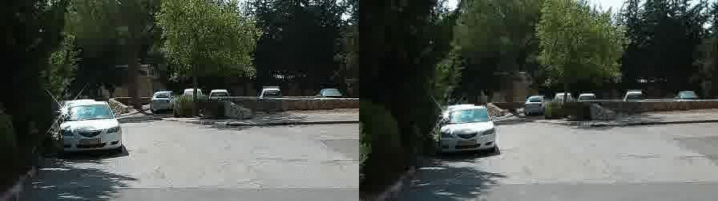

# Video Stabilization

<p align="center">
  
  <br>
</p>

## Video Stabilization with L1 optimal camera paths

This video stabilization method uses a Linear Programming formulation to smoothen out the camera path. It is successful in removing bith low and high frequency disturbances. The method is quite light weight compared to other offline video stabilization techniques and is (or once was) deployed as YouTube's video-stabilization algorithm. 

At a high level, the procedure followed by the algorithm is to stabilize videos offline by,

1. Obtaining the Shaky camera trajectory for the entire frame sequence
2. Smoothening this camera trajectory using an averaging (or otherwise any low pass) filter
3. Use the stabilized camera trajectory to construct a stabilized video sequence by applying warping transforms since transforms in the homogeneous coordinate system can be composed together

## Requirements

- python3
- numpy
- opencv
- matplotlib
- PuLP

## Usage Instructions

```bash
python3 L1optimal.py -i "$video" -o "$out_name" -crop-ratio 0.7 --trajPlot
```

Command line parameters-

`-i` is the complete path to the input video, required 

`-o` is the complete path to the output video, required

`-crop-ratio` is a user defined hyper parameter that tells the optimization procedure how much it can crop, required

`--trajPlot` is a True/False parameter. When the flag is passed the before and after camera trajectories are plotted in the folder of the file `$out_name`. If specifying make sure to include a folder called `plots/` in the same directory as `$out_name` else an error will be thrown.

## References

[1] [Auto directed video stabilization with Robust L1 optimal camera paths](https://smartech.gatech.edu/bitstream/handle/1853/44611/2011-Grundmann-AVSWROCP.pdf?sequence=1&isAllowed=y)

[2] [MATLAB implementation](https://github.com/ishit/L1Stabilizer)

## Related Work

- [A document](https://ishank-juneja.github.io/assets/docs/L1optimal.pdf) expanding on the linear programming formulation provided in the paper.

- [List of Other](https://github.com/yaochih/awesome-video-stabilization) Video Stabilization Methods and Implementations

- Deep Online Video Stabilization [implementation](https://github.com/cxjyxxme/deep-online-video-stabilization-deploy)

- [Averaging based video stabilization](https://learnopencv.com/video-stabilization-using-point-feature-matching-in-opencv/)

- [Subspace Video Stabilization](https://github.com/higerra/SubspaceStab)
